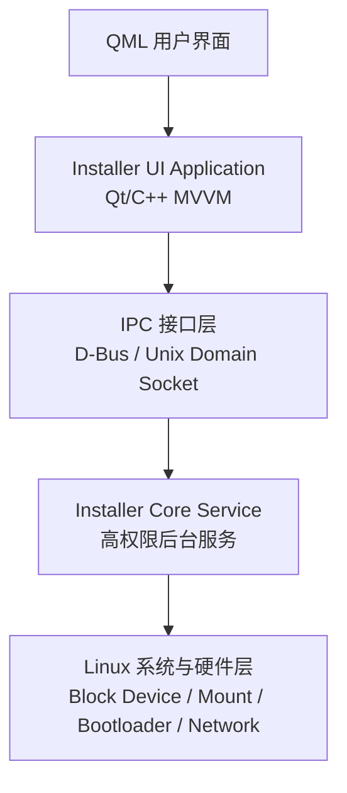
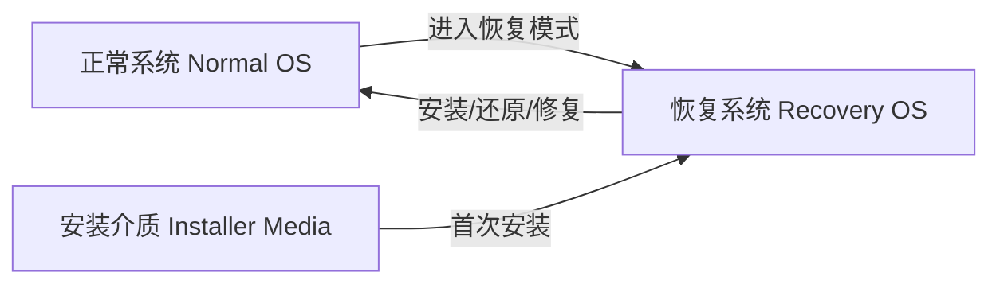
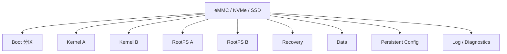
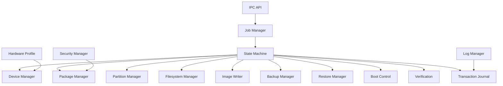
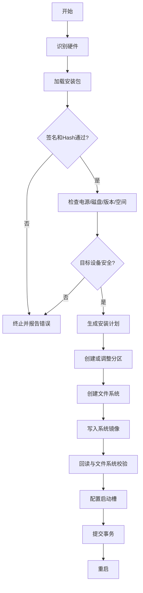
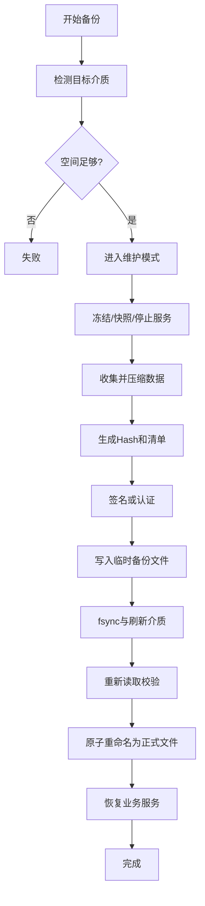

# 嵌入式 Linux 系统安装、软件备份与还原程序完整架构设计

> 适用场景：ARM64 / x86_64 嵌入式设备、医疗设备、工业设备、边缘计算终端、专用 Linux 设备  
> 推荐实现：C++17/20 + Qt 5.15/Qt 6 + QML + Linux 系统工具 + Recovery/Initramfs  
> 设计目标：可靠、可恢复、可审计、可扩展、掉电安全、界面与底层解耦

---

## 1. 项目目标

本程序用于在嵌入式设备上完成以下核心功能：

1. 全新系统安装。
2. 系统镜像升级。
3. 软件和配置备份。
4. 软件和配置还原。
5. 系统分区备份与恢复。
6. A/B 系统切换与失败回滚。
7. Recovery 恢复模式。
8. 安装包完整性校验与数字签名验证。
9. 安装、备份和还原过程可视化。
10. 操作日志、错误码和审计记录。
11. 支持 USB、移动硬盘、网络、本地恢复分区等介质。
12. 支持异常掉电、介质拔出、空间不足、校验失败等故障恢复。

本架构重点解决以下问题：

- QML UI 不直接执行高权限磁盘操作。
- 安装流程不能依赖大量 shell 脚本堆叠。
- 每个操作都必须有明确状态、进度、错误码和恢复策略。
- 写盘前后都要校验，防止“安装完成但系统不可启动”。
- 备份文件不能只依赖一个 MD5 文件判断是否可靠。
- 升级失败后设备必须能够自动回到旧系统。
- 任何中断都不应导致设备永久变砖。

---

## 2. 总体架构

整个系统建议拆分为五个层次：



### 2.1 五层职责

| 层级 | 主要职责 | 推荐技术 |
|---|---|---|
| QML UI 层 | 页面、动画、交互、进度展示、错误提示 | QML / Qt Quick Controls |
| UI 应用层 | ViewModel、页面状态、参数校验、IPC 调用 | C++ / Qt |
| IPC 层 | UI 与高权限服务通信、事件推送 | D-Bus 或 Unix Socket |
| 核心服务层 | 安装、备份、还原、校验、分区、挂载、日志 | C++ |
| 系统适配层 | 操作块设备、文件系统、Bootloader、网络 | Linux API + 工具封装 |

---

## 3. 推荐部署形态

建议系统包含三个运行环境。



### 3.1 正常系统

负责日常业务运行，也可以提供：

- 创建用户数据备份。
- 下载升级包。
- 检查升级包。
- 设置下次启动进入 Recovery。
- 查看历史安装和备份记录。

正常系统中不建议直接覆盖当前正在运行的根文件系统。

### 3.2 Recovery 系统

Recovery 是整个方案中最重要的部分。

推荐形式：

- 独立 Recovery 分区。
- Initramfs 内存系统。
- 只读 SquashFS 系统。
- U 盘启动环境。
- 独立最小 Linux 根文件系统。

Recovery 中运行：

- QML 安装界面。
- Installer Core Service。
- 分区和文件系统工具。
- 网络模块。
- 校验与签名模块。
- 日志和故障诊断模块。

由于 Recovery 不使用目标根分区，因此可以安全地格式化、写入和校验目标系统。

### 3.3 安装介质

安装介质可以是：

- USB U 盘。
- USB 移动硬盘。
- SD 卡。
- 本地恢复分区。
- 网络服务器。
- 工厂烧录设备。

安装介质建议包含：

```text
installer-media/
├── boot/
│   ├── kernel.img
│   ├── initrd.img
│   └── device-tree.dtb
├── packages/
│   └── system-package.espkg
├── installer/
│   ├── installer-ui
│   └── installer-core
├── manifest.json
├── manifest.sig
└── version.txt
```

---

## 4. 推荐分区设计

推荐使用 A/B 双系统设计。



### 4.1 推荐分区表

| 分区 | 用途 | 文件系统 | 是否格式化 |
|---|---|---|---|
| boot | Bootloader 配置、启动标记 | FAT32/ext4 | 谨慎 |
| kernel_a | A 槽内核、DTB、initramfs | raw/ext4 | 升级 A 时写入 |
| kernel_b | B 槽内核、DTB、initramfs | raw/ext4 | 升级 B 时写入 |
| rootfs_a | A 槽根文件系统 | ext4/squashfs | 升级 A 时写入 |
| rootfs_b | B 槽根文件系统 | ext4/squashfs | 升级 B 时写入 |
| recovery | 恢复系统 | squashfs/ext4 | 少量升级 |
| data | 用户数据、业务数据 | ext4 | 默认保留 |
| config | 设备配置、序列号、标定数据 | ext4 | 严格保留 |
| logs | 安装日志、故障日志 | ext4 | 可循环清理 |

### 4.2 对现有分区结构的兼容

如果现有设备已经采用类似结构：

```text
p1  boot
p2  recovery/sos
p3  kernel A
p4  kernel B
p5  root A
p6  root B
p7  overlay
p8  data
```

可以直接映射为：

| 现有分区 | 架构角色 |
|---|---|
| p1 | boot |
| p2 | recovery |
| p3 | kernel_a |
| p4 | kernel_b |
| p5 | rootfs_a |
| p6 | rootfs_b |
| p7 | persistent overlay/config |
| p8 | user/business data |

建议不要在业务代码中硬编码 `/dev/mmcblk0p5`，而应通过：

- PARTUUID。
- GPT PARTLABEL。
- 文件系统 LABEL。
- `/dev/disk/by-partuuid/`。
- `/dev/disk/by-label/`。

来定位分区。

---

## 5. 核心进程设计

建议包含以下进程。

```text
/usr/bin/installer-ui
/usr/sbin/installer-core
/usr/sbin/installer-watchdog
/usr/bin/installer-cli
```

### 5.1 installer-ui

职责：

- 运行 QML 界面。
- 展示安装、备份、还原任务。
- 收集用户选择。
- 显示磁盘、版本、空间、设备信息。
- 通过 IPC 调用 installer-core。
- 不直接执行 `dd`、`mkfs`、`mount`、`parted`。

权限：

- 普通用户运行。
- 只允许访问必要的输入设备、显示设备和 IPC 接口。

### 5.2 installer-core

职责：

- 以 root 权限运行。
- 设备发现。
- 分区表创建。
- 文件系统创建。
- 镜像解包和写入。
- 安装包校验。
- 备份与还原。
- Bootloader 更新。
- A/B 槽管理。
- 事务日志。
- 任务状态机。
- 错误恢复。
- 进度计算。

建议以 systemd 服务方式运行：

```ini
[Unit]
Description=Embedded Linux Installer Core
After=local-fs.target
Before=installer-ui.service

[Service]
Type=simple
ExecStart=/usr/sbin/installer-core --config /etc/installer/config.yaml
Restart=on-failure
RestartSec=1
NoNewPrivileges=false
PrivateTmp=true

[Install]
WantedBy=multi-user.target
```

### 5.3 installer-watchdog

职责：

- 检测 installer-core 是否卡死。
- 检测写盘超时。
- 检测磁盘 I/O 错误。
- 在必要时重启服务。
- 记录最后心跳和任务阶段。
- 不自动重复高风险写盘操作，必须先读取事务日志判断是否安全。

### 5.4 installer-cli

用于：

- 工厂自动化。
- SSH 调试。
- 无屏设备。
- 自动测试。
- 故障恢复。

示例：

```bash
installer-cli device list
installer-cli package verify /mnt/usb/system.espkg
installer-cli install --package /mnt/usb/system.espkg --target /dev/mmcblk0
installer-cli backup create --profile user-data
installer-cli restore --backup /mnt/usb/backup.esbak
installer-cli status
installer-cli logs export /mnt/usb/
```

CLI 和 QML UI 必须共用同一个 installer-core，不应各自实现一套安装逻辑。

---

## 6. 核心软件模块



### 6.1 DeviceManager

负责：

- 枚举块设备。
- 区分 eMMC、NVMe、SATA、USB、SD。
- 获取设备容量、扇区大小、只读状态。
- 判断系统盘和安装介质。
- 防止误写安装介质。
- 读取设备序列号、型号、健康状态。
- 监听热插拔。

推荐接口：

```cpp
struct BlockDeviceInfo {
    QString path;
    QString model;
    QString serial;
    quint64 sizeBytes;
    quint32 logicalSectorSize;
    quint32 physicalSectorSize;
    bool removable;
    bool readOnly;
    bool isSystemDisk;
    bool isInstallerMedia;
};

class IDeviceManager {
public:
    virtual QList<BlockDeviceInfo> scan() = 0;
    virtual bool isSafeTarget(const QString& device) = 0;
};
```

### 6.2 HardwareProfileManager

负责不同硬件型号的差异：

- 目标磁盘名称。
- 分区布局。
- DTB 文件。
- Bootloader 写入方式。
- 固件文件。
- 最小磁盘容量。
- CPU 架构。
- 设备型号兼容性。
- GPIO、RTC、NVRAM 等平台特性。

配置示例：

```yaml
hardware_profiles:
  - id: rk3588-rom6881-a1
    architecture: arm64
    min_disk_size_gib: 32
    target_disk_candidates:
      - /dev/mmcblk0
    dtb: rk3588-rom6881-a1.dtb
    bootloader:
      type: uboot
      env_backend: fw_setenv
    partition_layout: ab_standard_v1
```

### 6.3 PackageManager

负责：

- 打开安装包。
- 解析清单。
- 验证签名。
- 校验文件 Hash。
- 检查硬件兼容性。
- 检查版本升级路径。
- 检查空间。
- 提供包内文件流。

### 6.4 PartitionManager

负责：

- 读取当前分区表。
- 生成目标分区计划。
- 比较现有布局和目标布局。
- 创建 GPT/MBR。
- 新建、删除、扩容分区。
- 调用内核重新读取分区表。
- 等待 udev 节点出现。
- 验证实际分区布局。

建议优先 GPT。新产品不建议继续使用 MBR/MSDOS 分区表。

### 6.5 FilesystemManager

负责：

- mkfs。
- fsck。
- mount/umount。
- 文件系统 LABEL 和 UUID。
- resize2fs。
- 只读挂载。
- 挂载状态检查。
- 强制卸载前检查占用进程。

### 6.6 ImageWriter

支持：

- raw 镜像写入。
- sparse 镜像写入。
- tar 文件系统展开。
- squashfs 写入。
- zstd/gzip 流式解压写入。
- 写入进度计算。
- 写入后 Hash 校验。
- `fsync()` 和缓存刷新。
- I/O 错误检测。

不建议简单执行：

```bash
dd if=image.img of=/dev/mmcblk0p5
```

后就直接认为成功。正确流程应包含：

1. 打开源文件。
2. 验证源 Hash。
3. 以 O_DIRECT 或合理缓存策略写入。
4. 处理短写。
5. 调用 `fsync()`。
6. 调用 `BLKFLSBUF` 或等待设备完成写缓存。
7. 从目标设备抽样或完整回读校验。
8. 检查文件系统。
9. 更新事务状态。

### 6.7 BackupManager

负责：

- 创建备份计划。
- 停止相关业务服务。
- 冻结数据。
- 收集文件。
- 生成清单。
- 压缩。
- 加密。
- 写入目标介质。
- 校验备份。
- 安全恢复业务服务。

### 6.8 RestoreManager

负责：

- 读取备份包。
- 验证签名和 Hash。
- 检查设备匹配。
- 检查软件版本兼容。
- 执行预还原脚本。
- 还原文件。
- 恢复权限、ACL、xattr。
- 执行数据库迁移。
- 执行后处理。
- 生成还原报告。

### 6.9 BootControlManager

负责：

- 获取当前活动槽。
- 获取下一次启动槽。
- 设置 A/B 启动标志。
- 设置启动尝试次数。
- 设置 upgrade_pending。
- 标记新系统启动成功。
- 启动失败自动回滚。
- 进入 Recovery。
- 更新 Bootloader 环境变量。

典型状态变量：

```text
active_slot=A
next_slot=B
upgrade_pending=1
boot_attempts_left=3
slot_a_good=1
slot_b_good=0
```

### 6.10 VerificationManager

校验层次：

1. 安装包签名验证。
2. 包内清单 Hash 验证。
3. 解压过程校验。
4. 写盘后回读校验。
5. 文件系统 fsck。
6. 关键文件校验。
7. Bootloader 配置校验。
8. 首次启动自检。

推荐使用 SHA-256 或 SHA-512，不建议继续把 MD5 作为安全完整性校验算法。

MD5 可以用于快速发现普通传输错误，但不能作为防篡改安全机制。

### 6.11 TransactionJournal

事务日志是掉电恢复的关键。

建议存储在：

- 独立小分区。
- 持久化 config 分区。
- Recovery 可访问的位置。
- 同时写主副本。

示例：

```json
{
  "transaction_id": "8df2c3f6-ff81-4b2d-9e40-8adf4e1207e4",
  "operation": "system_install",
  "state": "WRITE_ROOTFS_B",
  "progress": 63,
  "target_device": "/dev/mmcblk0",
  "target_slot": "B",
  "package_version": "V0.0.0.34.01",
  "started_at": "2026-07-12T10:20:00Z",
  "last_update_at": "2026-07-12T10:25:33Z",
  "safe_to_resume": true,
  "completed_steps": [
    "VERIFY_PACKAGE",
    "CHECK_TARGET",
    "PREPARE_PARTITIONS",
    "WRITE_KERNEL_B"
  ]
}
```

写事务日志时必须：

- 写入临时文件。
- `fsync()` 文件。
- 原子 rename。
- `fsync()` 目录。
- 可选保留前一版本。

---

## 7. Job 与状态机架构

所有安装、备份、还原操作统一抽象为 Job。

```cpp
enum class JobType {
    InstallSystem,
    UpgradeSystem,
    BackupData,
    RestoreData,
    RepairSystem,
    VerifyPackage,
    ExportLogs
};

enum class JobState {
    Idle,
    Preparing,
    Running,
    Paused,
    Cancelling,
    Completed,
    Failed,
    Recoverable,
    RebootRequired
};
```

### 7.1 JobManager

职责：

- 同一时间只允许一个高风险磁盘任务。
- 分配 Job ID。
- 保存任务状态。
- 提供取消能力。
- 提供进度和日志。
- 重启后恢复未完成任务。
- 对外发布状态事件。

### 7.2 步骤化状态机

每个 Job 由多个 Step 组成。

```cpp
class IJobStep {
public:
    virtual QString id() const = 0;
    virtual StepResult prepare(JobContext&) = 0;
    virtual StepResult execute(JobContext&) = 0;
    virtual StepResult verify(JobContext&) = 0;
    virtual StepResult rollback(JobContext&) = 0;
    virtual bool canResume() const = 0;
};
```

安装任务示例：

```text
DetectHardware
LoadPackage
VerifySignature
CheckCompatibility
CheckPower
CheckStorage
UnmountTarget
PreparePartitionTable
CreateFilesystems
WriteBootloader
WriteKernel
WriteRootfs
RestorePersistentConfig
VerifyTarget
ConfigureBootSlot
FinalizeTransaction
Reboot
```

---

## 8. 系统安装流程



### 8.1 安装前检查

至少包括：

- 电池电量或外部电源状态。
- 安装包是否完整。
- 安装包是否适配当前硬件。
- 目标设备容量。
- 目标设备是否只读。
- 安装介质是否稳定。
- 当前系统是否正在使用目标分区。
- 配置分区是否存在重要设备标定数据。
- 是否需要保存旧系统数据。
- 目标版本是否允许降级。
- Bootloader 是否支持目标镜像。

### 8.2 全新安装

全新安装可以重新创建分区表。

推荐规则：

- 清空前再次确认目标磁盘序列号。
- 备份设备唯一信息。
- 创建分区。
- 写 Bootloader。
- 写 Recovery。
- 写 A 槽系统。
- 可选复制 A 到 B。
- 创建 data/config。
- 写入设备初始化标记。
- 设置 A 为活动槽。
- 首次启动进入 provisioning 流程。

### 8.3 系统升级

A/B 升级流程：

1. 当前运行 A。
2. 把新系统写入 B。
3. 校验 B。
4. 设置 next_slot=B。
5. 设置 upgrade_pending=1。
6. 重启进入 B。
7. B 启动后执行自检。
8. 自检成功后标记 B good。
9. 清除 upgrade_pending。
10. 如果连续启动失败，则 Bootloader 回到 A。

升级时不要覆盖当前活动槽。

### 8.4 原地升级

只有在存储空间不足且无法使用 A/B 时才考虑原地升级。

原地升级必须：

- 在 Recovery 中执行。
- 先创建可恢复备份。
- 使用事务日志。
- 先写临时位置。
- 原子切换关键文件。
- 保留旧内核和旧 rootfs。
- 有明确的失败恢复入口。

---

## 9. 安装包格式设计

建议定义自有容器格式，例如 `.espkg`。

底层可以采用：

- tar + zstd。
- zip。
- squashfs。
- 自定义容器。

推荐目录：

```text
system-package.espkg
├── manifest.json
├── manifest.sig
├── payload/
│   ├── bootloader.img
│   ├── kernel.img
│   ├── rootfs.img.zst
│   ├── recovery.img
│   ├── device-tree.dtb
│   └── firmware/
├── scripts/
│   ├── pre_install.sh
│   ├── post_install.sh
│   └── migrate.sh
└── metadata/
    ├── release-notes.md
    └── license.txt
```

### 9.1 manifest.json

```json
{
  "format_version": 1,
  "package_id": "grapeos-rk3588",
  "product": "Embedded Medical Device",
  "version": "0.0.34.01",
  "build_id": "20260712.1",
  "architecture": "arm64",
  "hardware_profiles": [
    "rk3588-rom6881-a1"
  ],
  "min_installer_version": "1.2.0",
  "min_disk_size_bytes": 32000000000,
  "allow_downgrade": false,
  "payloads": [
    {
      "name": "kernel_b",
      "file": "payload/kernel.img",
      "target": "kernel_inactive",
      "type": "raw",
      "size": 209715200,
      "sha256": "..."
    },
    {
      "name": "rootfs_b",
      "file": "payload/rootfs.img.zst",
      "target": "rootfs_inactive",
      "type": "ext4_zstd",
      "uncompressed_size": 4294967296,
      "sha256": "..."
    }
  ]
}
```

### 9.2 包签名

推荐：

- Ed25519。
- RSA-PSS。
- ECDSA P-256。

设备中只内置公钥，私钥只保存在构建服务器或发布系统。

验证顺序：

1. 验证 `manifest.sig`。
2. 解析 manifest。
3. 检查硬件型号。
4. 逐个验证 payload 的 SHA-256。
5. 执行安装。

---

## 10. 备份架构

备份分为三类。

### 10.1 配置备份

内容：

- 应用配置。
- 网络配置。
- 用户偏好。
- 设备名称。
- 授权信息。
- 非敏感业务参数。

特点：

- 体积小。
- 速度快。
- 可频繁执行。
- 可跨小版本恢复。

### 10.2 业务数据备份

内容：

- 数据库。
- 检查记录。
- 医疗影像。
- 用户文件。
- 业务日志。

特点：

- 数据量大。
- 需要一致性处理。
- 可能涉及隐私和加密。
- 需要版本兼容。

### 10.3 系统级备份

内容：

- 内核。
- rootfs。
- 配置分区。
- Bootloader 环境。
- 分区信息。

特点：

- 用于灾难恢复。
- 建议在 Recovery 离线执行。
- 不建议在业务系统在线状态下直接块级复制正在写入的 ext4 分区。

---

## 11. 备份一致性设计

### 11.1 离线备份

最可靠方式：

1. 重启进入 Recovery。
2. 不挂载或只读挂载目标分区。
3. 执行 fsck。
4. 备份文件或块设备。
5. 生成清单。
6. 校验备份。
7. 返回正常系统。

适合：

- 系统完整备份。
- 数据库完整备份。
- 出厂备份。
- 售后维护。

### 11.2 在线备份

在线备份必须处理一致性。

推荐流程：

1. 通知业务应用进入维护状态。
2. 阻止新写入。
3. 数据库执行 checkpoint。
4. 停止相关服务。
5. 调用 `sync()`。
6. 可选 `fsfreeze`。
7. 复制数据。
8. 解冻文件系统。
9. 恢复服务。

对于 SQLite：

```text
PRAGMA wal_checkpoint(FULL);
关闭数据库连接；
复制 db、-wal、-shm 或使用 SQLite Backup API。
```

对于 PostgreSQL/MySQL，应使用数据库原生备份机制，不要直接复制运行中的数据目录。

---

## 12. 备份包格式

建议定义 `.esbak` 格式。

```text
backup-20260712-102000.esbak
├── manifest.json
├── manifest.sig
├── content/
│   ├── config.tar.zst
│   ├── database.tar.zst
│   ├── user-data.tar.zst
│   └── system-metadata.json
├── checksums.sha256
└── report.txt
```

### 12.1 备份清单

```json
{
  "format_version": 1,
  "backup_id": "b4b6297e-cb66-4c44-8e2f-2343d85f9857",
  "created_at": "2026-07-12T10:20:00Z",
  "device_model": "rk3588-rom6881-a1",
  "device_serial": "DEVICE-0001024",
  "system_version": "0.0.33.02",
  "backup_profile": "full_user_data",
  "encrypted": true,
  "components": [
    {
      "name": "application-config",
      "file": "content/config.tar.zst",
      "sha256": "..."
    }
  ]
}
```

### 12.2 备份加密

涉及医疗、工业或个人数据时，建议支持：

- AES-256-GCM。
- XChaCha20-Poly1305。
- 每个备份使用随机数据密钥。
- 数据密钥由设备密钥或用户口令派生密钥加密。
- 密钥不能明文保存在备份包中。

---

## 13. 备份流程



### 13.1 临时文件策略

写备份时使用：

```text
backup-xxx.esbak.partial
```

只有全部写入并校验成功后，才 rename 为：

```text
backup-xxx.esbak
```

这样可以避免用户把未完成文件误认为有效备份。

---

## 14. 还原架构

还原分为：

- 配置还原。
- 业务数据还原。
- 完整系统还原。
- 指定组件还原。
- 出厂设置恢复。

### 14.1 还原前检查

- 备份包是否完整。
- 签名是否可信。
- 设备型号是否匹配。
- 设备序列号是否要求一致。
- 当前软件版本是否兼容。
- 数据库 schema 是否兼容。
- 目标空间是否足够。
- 是否会覆盖现有数据。
- 是否需要先创建当前状态备份。
- 是否需要进入 Recovery。

### 14.2 安全还原流程

1. 验证备份包。
2. 创建当前状态快照或回滚点。
3. 进入维护模式。
4. 解包到临时目录。
5. 验证解包内容。
6. 执行 schema 迁移。
7. 把当前文件移动到 rollback 目录。
8. 原子替换新文件。
9. 修复权限、所有者、ACL、xattr。
10. 启动服务。
11. 执行功能自检。
12. 自检成功后删除 rollback 数据。
13. 自检失败则自动回滚。

---

## 15. QML UI 架构

推荐采用 MVVM。


### 15.1 页面结构

```text
qml/
├── App.qml
├── pages/
│   ├── HomePage.qml
│   ├── InstallPage.qml
│   ├── UpgradePage.qml
│   ├── BackupPage.qml
│   ├── RestorePage.qml
│   ├── RecoveryPage.qml
│   ├── DeviceSelectionPage.qml
│   ├── PackageSelectionPage.qml
│   ├── ProgressPage.qml
│   ├── ResultPage.qml
│   ├── LogsPage.qml
│   └── SettingsPage.qml
├── components/
│   ├── StepIndicator.qml
│   ├── ProgressPanel.qml
│   ├── WarningDialog.qml
│   ├── DeviceCard.qml
│   ├── PackageCard.qml
│   ├── LogViewer.qml
│   └── ErrorPanel.qml
└── themes/
    ├── Theme.qml
    └── Icons.qml
```

### 15.2 C++ ViewModel

```text
src/ui/viewmodels/
├── HomeViewModel
├── InstallViewModel
├── BackupViewModel
├── RestoreViewModel
├── DeviceListViewModel
├── PackageViewModel
├── JobProgressViewModel
├── LogViewModel
└── SettingsViewModel
```

示例：

```cpp
class InstallViewModel : public QObject {
    Q_OBJECT
    Q_PROPERTY(QString selectedPackage READ selectedPackage NOTIFY selectedPackageChanged)
    Q_PROPERTY(QString selectedDevice READ selectedDevice NOTIFY selectedDeviceChanged)
    Q_PROPERTY(int progress READ progress NOTIFY progressChanged)
    Q_PROPERTY(QString currentStep READ currentStep NOTIFY currentStepChanged)
    Q_PROPERTY(bool running READ running NOTIFY runningChanged)

public:
    Q_INVOKABLE void scanPackages();
    Q_INVOKABLE void scanDevices();
    Q_INVOKABLE void startInstall();
    Q_INVOKABLE void cancelInstall();
};
```

### 15.3 UI 交互原则

- 高风险操作必须二次确认。
- 二次确认中显示磁盘型号、容量、序列号。
- 不使用只显示 `/dev/mmcblk0` 的模糊提示。
- 写盘过程中禁止随意返回首页。
- 可以取消的步骤显示取消按钮。
- 不可取消的关键阶段明确提示。
- 错误信息同时显示人类可读说明和错误码。
- 支持导出日志。
- 支持断点恢复提示。

---

## 16. IPC 设计

优先推荐 D-Bus。

优点：

- Linux 原生。
- 支持权限控制。
- 支持异步信号。
- Qt 有成熟支持。
- 容易被 CLI 和测试工具复用。

### 16.1 D-Bus 服务

```text
Service: com.company.Installer
Object:  /com/company/Installer
Interface: com.company.Installer.Manager
```

方法：

```text
ListDevices()
ListPackages()
VerifyPackage(path)
CreateInstallPlan(packageId, deviceId)
StartInstall(plan)
StartBackup(profile, destination)
StartRestore(backupPath, options)
CancelJob(jobId)
GetJob(jobId)
GetRecentLogs(limit)
SetBootSlot(slot)
Reboot(mode)
```

信号：

```text
JobCreated(jobId)
JobStateChanged(jobId, state)
JobProgressChanged(jobId, percent, step, message)
JobLog(jobId, level, message)
JobCompleted(jobId, result)
DeviceAdded(device)
DeviceRemoved(deviceId)
```

### 16.2 权限控制

使用 polkit 或 D-Bus policy：

- 普通用户可以查询状态。
- 只有 installer-ui 组可以启动安装。
- 远程用户默认不能启动写盘。
- 工厂模式可以通过专用证书或物理开关授权。

---

## 17. 错误码设计

错误码建议分层。

```text
E1xxx 设备与硬件
E2xxx 安装包
E3xxx 分区与文件系统
E4xxx 镜像写入
E5xxx 备份
E6xxx 还原
E7xxx Bootloader
E8xxx 网络
E9xxx 内部错误
```

示例：

| 错误码 | 含义 |
|---|---|
| E1001 | 未发现目标存储设备 |
| E1002 | 目标设备只读 |
| E1003 | 目标设备容量不足 |
| E2001 | 安装包格式无效 |
| E2002 | 安装包签名验证失败 |
| E2003 | 安装包与硬件不兼容 |
| E3001 | 分区表创建失败 |
| E3002 | 文件系统格式化失败 |
| E3003 | 分区挂载失败 |
| E4001 | 镜像写入失败 |
| E4002 | 写入后校验失败 |
| E5001 | 备份目标空间不足 |
| E5002 | 备份介质被拔出 |
| E6001 | 备份版本不兼容 |
| E7001 | Bootloader 环境写入失败 |

每个错误应包含：

```cpp
struct InstallerError {
    QString code;
    QString title;
    QString userMessage;
    QString technicalMessage;
    QString component;
    QString operation;
    bool retryable;
    bool rebootRequired;
};
```

---

## 18. 日志架构

日志分为四类：

1. 用户操作日志。
2. 安装流程日志。
3. 系统命令和底层 I/O 日志。
4. 审计日志。

推荐格式为 JSON Lines：

```json
{"time":"2026-07-12T10:20:01Z","level":"INFO","job":"123","component":"PackageManager","event":"verify_start","file":"system.espkg"}
{"time":"2026-07-12T10:20:10Z","level":"INFO","job":"123","component":"PackageManager","event":"verify_success"}
```

日志要求：

- 带时间戳。
- 带 Job ID。
- 带组件名。
- 带步骤名。
- 不记录明文密码和密钥。
- 日志滚动。
- 支持一键导出。
- 崩溃后仍可读取最后状态。
- 严重错误同步写入持久化分区。

---

## 19. 掉电保护

掉电是嵌入式安装系统必须重点考虑的问题。

### 19.1 设计原则

- 当前活动系统永远不在升级中被覆盖。
- 所有高风险任务都有事务日志。
- 关键配置原子更新。
- 使用 `.partial` 文件。
- 写入后执行 `fsync()`。
- Bootloader 标志最后更新。
- 新系统验证完成前，旧系统保持可启动。
- 关键操作前检查电源。
- 可以接入 UPS、电池、电源管理芯片。

### 19.2 掉电后的恢复策略

| 掉电阶段 | 恢复策略 |
|---|---|
| 校验安装包 | 重新校验 |
| 调整非活动槽分区 | 重新创建非活动槽 |
| 写入非活动 rootfs | 从头重写该分区 |
| 写入后校验 | 重新校验或重写 |
| 更新启动标志前 | 仍从旧槽启动 |
| 更新启动标志后、新系统未确认 | Bootloader 尝试新槽，失败后回滚 |
| 备份写入中 | 删除 `.partial` 文件 |
| 还原临时目录阶段 | 删除临时目录 |
| 原子替换后自检失败 | 使用 rollback 目录恢复 |

---

## 20. 安全架构

### 20.1 威胁模型

需要防止：

- 非授权安装包。
- 安装包被替换。
- 备份被篡改。
- 备份泄露。
- UI 被绕过直接调用 root 服务。
- 安装到错误硬盘。
- 降级到有漏洞的旧版本。
- 恶意脚本以 root 执行。
- 日志泄露敏感信息。

### 20.2 安全措施

- 所有正式安装包必须签名。
- installer-core 内置发布公钥。
- 支持公钥轮换。
- 限制脚本执行。
- 脚本运行在受限环境。
- 使用 seccomp、mount namespace、capabilities。
- UI 不以 root 运行。
- IPC 接口做鉴权。
- 限制安装介质自动执行。
- 禁止使用用户输入直接拼接 shell 命令。
- 设备关键配置单独备份。
- 备份数据加密。
- 防回滚版本计数器可存 TPM、RPMB、Secure Storage。
- 可选接入 Secure Boot 和 dm-verity。

---

## 21. 命令执行封装

不建议在 C++ 中大量使用：

```cpp
system("parted ...");
```

推荐封装统一的 ProcessRunner：

```cpp
struct ProcessResult {
    int exitCode;
    QByteArray stdoutData;
    QByteArray stderrData;
    bool timedOut;
    bool cancelled;
};

class ProcessRunner {
public:
    ProcessResult run(
        const QString& program,
        const QStringList& arguments,
        int timeoutMs,
        CancellationToken token);
};
```

要求：

- 程序和参数分开传递。
- 禁止 shell 拼接。
- 支持超时。
- 支持取消。
- 捕获 stdout/stderr。
- 记录命令版本。
- 对高风险命令做白名单。
- 对返回码做统一解释。

---

## 22. 推荐工程目录

```text
embedded-installer/
├── CMakeLists.txt
├── cmake/
├── config/
│   ├── installer.yaml
│   ├── partition-layouts.yaml
│   └── hardware-profiles.yaml
├── include/
│   └── installer/
├── src/
│   ├── app/
│   │   └── main.cpp
│   ├── ui/
│   │   ├── viewmodels/
│   │   ├── models/
│   │   └── ipc/
│   ├── core/
│   │   ├── jobs/
│   │   ├── steps/
│   │   ├── device/
│   │   ├── package/
│   │   ├── partition/
│   │   ├── filesystem/
│   │   ├── image/
│   │   ├── backup/
│   │   ├── restore/
│   │   ├── boot/
│   │   ├── security/
│   │   ├── verification/
│   │   ├── journal/
│   │   └── logging/
│   ├── platform/
│   │   ├── linux/
│   │   ├── rockchip/
│   │   └── generic/
│   ├── cli/
│   └── common/
├── qml/
├── tests/
│   ├── unit/
│   ├── integration/
│   ├── fault-injection/
│   └── hardware/
├── scripts/
│   ├── build-package.py
│   ├── sign-package.py
│   └── create-recovery.sh
├── packaging/
│   ├── systemd/
│   ├── dbus/
│   └── polkit/
└── docs/
```

---

## 23. 配置驱动设计

不要把分区大小、设备路径和文件名写死在代码里。

配置示例：

```yaml
installer:
  version: 1.2.0
  log_dir: /var/log/installer
  journal_dir: /var/lib/installer/journal
  require_external_power: true
  minimum_battery_percent: 40
  full_verify_after_write: true

storage:
  target_by: partlabel
  device_candidates:
    - /dev/mmcblk0
    - /dev/nvme0n1

partition_layouts:
  ab_standard_v1:
    table: gpt
    alignment_mib: 4
    partitions:
      - name: boot
        size_mib: 512
        filesystem: vfat
        label: BOOT
      - name: recovery
        size_mib: 4096
        filesystem: ext4
        label: RECOVERY
      - name: kernel_a
        size_mib: 256
        filesystem: raw
      - name: kernel_b
        size_mib: 256
        filesystem: raw
      - name: rootfs_a
        size_mib: 6144
        filesystem: ext4
        label: ROOT_A
      - name: rootfs_b
        size_mib: 6144
        filesystem: ext4
        label: ROOT_B
      - name: config
        size_mib: 1024
        filesystem: ext4
        label: CONFIG
      - name: data
        size: remaining
        filesystem: ext4
        label: DATA
```

---

## 24. Bootloader 与首次启动确认

### 24.1 U-Boot 推荐逻辑

```text
if recovery_requested=1:
    boot recovery

if upgrade_pending=1:
    boot next_slot
    decrement boot_attempts_left
    if boot_attempts_left == 0:
        mark next_slot bad
        boot previous_good_slot
else:
    boot active_slot
```

### 24.2 新系统启动确认服务

新系统启动后运行：

```text
system-health-check.service
```

检查：

- 根文件系统可读写。
- 关键服务启动成功。
- 数据分区可挂载。
- 关键硬件存在。
- 版本文件正确。
- 配置迁移完成。
- 应用可以启动。

全部通过后：

```bash
installer-cli boot mark-good --slot B
```

---

## 25. 软件备份配置文件

建议使用 Profile 描述备份内容。

```yaml
backup_profiles:
  application_config:
    include:
      - /etc/company/
      - /var/lib/company/settings/
    exclude:
      - "*.tmp"
      - "*.cache"
    stop_services:
      - company-app.service
    encryption: optional

  full_user_data:
    include:
      - /data/patients/
      - /data/images/
      - /var/lib/company/database/
    stop_services:
      - company-app.service
      - company-database.service
    encryption: required
    compression: zstd
```

---

## 26. 软件还原迁移机制

不同版本之间还原时，不能简单覆盖全部配置。

推荐给每类数据定义 schema 版本：

```json
{
  "component": "application-config",
  "schema_version": 5,
  "created_by_system_version": "0.0.33.02"
}
```

还原时：

```text
schema 3 -> migration_3_to_4 -> migration_4_to_5
```

迁移程序必须：

- 可重复执行。
- 支持失败回滚。
- 有输入输出校验。
- 记录迁移日志。
- 禁止直接修改原备份文件。

---

## 27. 进度计算

不要只显示虚假的线性进度。

每个 Step 配置权重：

```text
验证安装包        10%
准备分区          10%
写入内核           5%
写入根文件系统    50%
写入应用数据      10%
写入后校验        10%
配置启动项          3%
完成处理            2%
```

大文件写入进度根据：

```text
processed_bytes / total_bytes
```

计算。

UI 显示：

- 总进度。
- 当前步骤。
- 当前文件。
- 已处理大小。
- 总大小。
- 当前速度。
- 预计剩余时间。
- 详细日志。

预计剩余时间只能作为参考，不能用于流程判断。

---

## 28. 取消策略

不同阶段的取消能力不同。

| 阶段 | 是否允许取消 | 处理方式 |
|---|---|---|
| 扫描设备 | 可以 | 立即停止 |
| 校验安装包 | 可以 | 停止校验 |
| 下载升级包 | 可以 | 保留断点文件 |
| 创建分区表 | 不建议 | 完成当前原子步骤 |
| 格式化分区 | 不建议 | 完成后停止 |
| 写入非活动槽 | 可以 | 标记目标槽无效 |
| 更新 Bootloader | 不允许 | 完成关键更新 |
| 备份压缩 | 可以 | 删除 partial |
| 数据还原替换 | 受限 | 回滚后停止 |

UI 必须根据当前步骤动态决定是否展示取消按钮。

---

## 29. 测试体系

### 29.1 单元测试

覆盖：

- manifest 解析。
- 版本比较。
- 分区计划计算。
- Hash 校验。
- 状态机切换。
- 错误码映射。
- 备份 include/exclude 规则。
- 迁移路径选择。

### 29.2 集成测试

使用 loop device 模拟磁盘：

```bash
truncate -s 16G test-disk.img
losetup --find --show test-disk.img
```

测试：

- 创建 GPT。
- 创建 ext4。
- 写入镜像。
- 挂载验证。
- 备份和还原。
- A/B 切换。
- 日志恢复。

### 29.3 故障注入测试

必须覆盖：

- 写入 10% 时断电。
- 写入 90% 时断电。
- 校验时拔出 U 盘。
- 备份时空间耗尽。
- 文件系统损坏。
- 安装包 Hash 错误。
- manifest 签名错误。
- 目标盘变成只读。
- `fsync()` 返回错误。
- Bootloader 环境写入失败。
- UI 崩溃。
- installer-core 崩溃。
- watchdog 重启。
- 网络下载中断。
- 重复恢复同一事务。

### 29.4 硬件测试

- 不同 eMMC 品牌。
- 不同容量。
- 不同 USB 介质。
- 低速 U 盘。
- 坏块设备。
- 高温环境。
- 电压波动。
- RTC 异常。
- 无网络环境。
- 多块磁盘同时存在。
- USB 热插拔。
- 设备长时间运行。

---

## 30. CI/CD 与发布

推荐流水线：


发布产物：

```text
installer-ui
installer-core
installer-cli
recovery.img
system-package.espkg
system-package.espkg.sha256
release-notes.md
SBOM.spdx.json
```

建议生成 SBOM，记录：

- 软件包版本。
- 开源组件。
- License。
- CVE 信息。
- 编译器版本。
- Git Commit。
- 构建时间。
- 构建机器标识。

---

## 31. C++ 关键接口建议

### 31.1 Job 接口

```cpp
class InstallerJob : public QObject {
    Q_OBJECT
public:
    virtual QString id() const = 0;
    virtual JobType type() const = 0;
    virtual JobState state() const = 0;
    virtual void start() = 0;
    virtual void cancel() = 0;
    virtual bool resume() = 0;

signals:
    void stateChanged(JobState state);
    void progressChanged(int percent, QString step, QString message);
    void logGenerated(QString level, QString message);
    void finished(bool success, InstallerError error);
};
```

### 31.2 存储操作接口

```cpp
class IStorageBackend {
public:
    virtual QList<BlockDeviceInfo> enumerateDevices() = 0;
    virtual PartitionTable readPartitionTable(const QString& device) = 0;
    virtual Result applyPartitionPlan(
        const QString& device,
        const PartitionPlan& plan) = 0;
    virtual Result format(
        const QString& partition,
        FilesystemType type,
        const QString& label) = 0;
    virtual Result mount(
        const QString& partition,
        const QString& mountPoint,
        MountFlags flags) = 0;
};
```

### 31.3 镜像写入接口

```cpp
class IImageWriter {
public:
    virtual Result write(
        QIODevice& source,
        const QString& target,
        const WriteOptions& options,
        ProgressCallback progress,
        CancellationToken token) = 0;

    virtual Result verify(
        QIODevice& source,
        const QString& target,
        const VerifyOptions& options,
        ProgressCallback progress) = 0;
};
```

---

## 32. 性能设计

### 32.1 流式处理

避免先完整解压到内存或临时分区。

推荐：

```text
zstd compressed image
        |
        v
stream decompressor
        |
        v
buffered writer
        |
        v
target block device
```

### 32.2 缓冲区

建议：

- 1 MiB 到 8 MiB 块。
- 根据内存大小配置。
- 使用双缓冲或生产者消费者模型。
- 写入线程与解压线程分离。
- 对低速介质限制并发。

### 32.3 零拷贝

可以使用：

- `sendfile()`。
- `splice()`。
- `copy_file_range()`。
- `mmap()`。

但写入块设备、解压流、Hash 计算时，清晰可靠比盲目零拷贝更重要。

---

## 33. 与 Shell 脚本的边界

Shell 仍可以用于：

- 构建镜像。
- 开发阶段测试。
- 非关键辅助操作。
- 系统集成脚本。
- 工厂流水线包装。

核心安装流程建议由 C++ 控制。

可以调用成熟工具：

- `sgdisk`。
- `parted`。
- `mkfs.ext4`。
- `e2fsck`。
- `resize2fs`。
- `mount`。
- `tar`。
- `zstd`。
- `fw_printenv`。
- `fw_setenv`。

但必须通过统一 ProcessRunner 封装，不能在业务逻辑中到处散落命令字符串。

---

## 34. 建议技术选型

| 模块 | 推荐 |
|---|---|
| UI | Qt Quick/QML |
| UI 业务层 | C++ + QObject/ViewModel |
| IPC | QtDBus / D-Bus |
| 核心服务 | C++17/20 |
| 配置 | YAML/JSON |
| 日志 | spdlog 或自研结构化日志 |
| JSON | nlohmann/json 或 Qt JSON |
| 压缩 | zstd |
| 加密 | OpenSSL/libsodium |
| 签名 | Ed25519 |
| Hash | SHA-256 |
| 分区 | libfdisk/libparted 或封装 sgdisk |
| 文件系统 | e2fsprogs 工具封装 |
| 测试 | GoogleTest/Qt Test |
| 构建 | CMake |
| 服务管理 | systemd |
| 设备事件 | udev/libudev |
| Bootloader | U-Boot env 或平台适配层 |

---

## 35. 推荐开发阶段

### 第一阶段：最小可运行版本

完成：

- QML 首页。
- 设备扫描。
- 安装包选择。
- SHA-256 校验。
- 单分区 rootfs 写入。
- 进度显示。
- 日志导出。
- CLI。

### 第二阶段：可靠安装

完成：

- installer-core 服务。
- D-Bus。
- 状态机。
- 事务日志。
- 分区创建。
- 写入后校验。
- 掉电恢复。
- Recovery 环境。

### 第三阶段：A/B 升级

完成：

- 活动槽检测。
- 非活动槽升级。
- U-Boot 启动标志。
- 启动次数限制。
- 自动回滚。
- 首次启动健康检查。

### 第四阶段：备份与还原

完成：

- 配置备份。
- 业务数据备份。
- 备份加密。
- 还原事务。
- schema 迁移。
- 备份管理页面。

### 第五阶段：产品化

完成：

- 数字签名。
- Secure Boot。
- 权限控制。
- 工厂模式。
- 网络升级。
- 远程诊断。
- 多硬件 Profile。
- CI/CD。
- 故障注入测试。
- 审计和合规。

---

## 36. 推荐最终运行流程

### 正常升级

```text
正常系统下载升级包
        ↓
验证签名和版本
        ↓
设置进入 Recovery
        ↓
重启到 Recovery
        ↓
QML 显示升级任务
        ↓
installer-core 写入非活动槽
        ↓
写入后完整校验
        ↓
设置下次启动槽
        ↓
重启进入新系统
        ↓
健康检查
        ↓
标记新槽成功
```

### 创建完整备份

```text
正常系统选择“完整备份”
        ↓
重启到 Recovery
        ↓
只读挂载目标分区
        ↓
文件系统检查
        ↓
收集配置、数据库和数据
        ↓
压缩、加密、生成清单
        ↓
写入 .partial
        ↓
刷新介质并重新校验
        ↓
原子重命名为 .esbak
```

### 执行还原

```text
选择备份包
        ↓
验证签名和 Hash
        ↓
检查设备和版本兼容性
        ↓
创建当前状态回滚点
        ↓
进入维护模式
        ↓
解包到临时目录
        ↓
执行版本迁移
        ↓
原子替换数据
        ↓
启动服务并自检
        ↓
成功则提交，失败则回滚
```

---

## 37. 最重要的工程原则

1. UI 与 root 权限核心服务分离。
2. 安装、备份、还原统一使用 Job 和状态机。
3. 所有高风险操作都要有事务日志。
4. 正常升级只写非活动槽。
5. 新系统未经健康检查不能标记为成功。
6. 不把设备路径、分区编号和容量硬编码在代码中。
7. 不把 MD5 当作安全校验算法。
8. 备份文件先写 `.partial`，校验成功后再原子改名。
9. 写盘完成必须刷新缓存并回读校验。
10. 对异常掉电、介质拔出、空间不足进行故障注入测试。
11. QML 只负责交互，不负责磁盘操作。
12. CLI、QML 和工厂工具共用同一套核心服务。
13. Recovery 必须能够在主系统完全损坏时独立启动。
14. 设备唯一配置、标定数据和授权信息必须独立保护。
15. 每次安装和还原都必须能够生成完整报告。

---

## 38. 总结

一个成熟的嵌入式 Linux 安装、备份和还原程序，本质上不是“带界面的 dd + tar 脚本”，而是一个具备以下能力的事务型系统管理平台：

- 有独立 Recovery 环境。
- 有 QML 图形界面。
- 有高权限后台核心服务。
- 有设备和硬件抽象层。
- 有安装包和备份包规范。
- 有完整状态机。
- 有事务日志。
- 有 A/B 启动和回滚。
- 有签名、Hash、加密和权限控制。
- 有掉电恢复。
- 有统一错误码和日志。
- 有自动测试和故障注入测试。

对于现有基于 eMMC、U-Boot、initrd、kernel A/B、rootfs A/B、overlay 和 data 分区的设备，可以在保留现有分区设计的基础上，逐步把 shell 脚本中的流程迁移到 `installer-core`，再通过 D-Bus 暴露给 QML 界面和 CLI。

推荐第一步先完成：

```text
installer-core
    + DeviceManager
    + PackageManager
    + ImageWriter
    + JobManager
    + TransactionJournal
    + D-Bus API
    + QML ProgressPage
```

这几个模块完成后，系统安装、备份和还原的主体架构就已经建立，后续可以逐步加入 A/B 回滚、加密备份、网络升级和多硬件平台支持。
